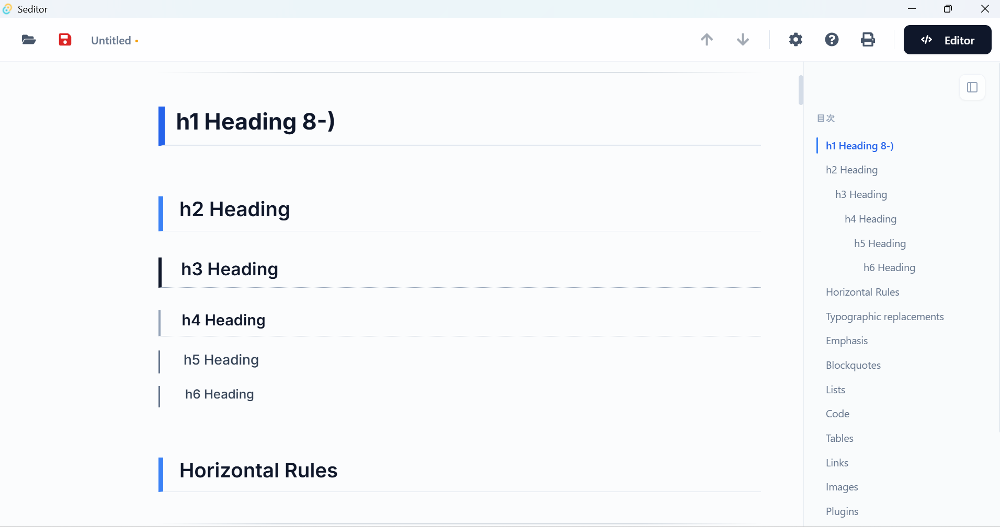

# Seditor




サクラエディタみたいにサッと起動して、Obsidian みたいにきれいにプレビューできる。そんなMarkdownエディタが欲しくて作りました。

Tauri (Rust) ベースなので起動は一瞬、メモリもほとんど食いません。ファイルはすべてローカル管理。

## 特徴

- **とにかく軽い** — Tauri + Rust で起動1秒以内。Electron 系とは次元が違います
- **編集↔プレビュー切り替え** — `Ctrl+E` で一発。書きながら確認がスムーズ
- **Markdownフル対応**
  - 数式 (KaTeX)、図 (Mermaid)、GFMテーブル、絵文字
  - コードブロックのシンタックスハイライト + コピーボタン
  - 画像プレビュー（ローカル/Web どちらも）
- **検索・置換** — 正規表現にも対応
- **キーボード操作で完結** — マウスなしでほぼ全操作OK
- **PDF出力** — プレビューモードから `Ctrl+P` で印刷 / PDF保存
- **`.md` ファイル関連付け** — エクスプローラーからダブルクリックで開ける

## ショートカット

| キー | 操作 | 説明 |
| :--- | :--- | :--- |
| `Ctrl+E` | モード切替 | 編集 ↔ プレビュー |
| `Ctrl+S` | 保存 | 上書き保存（新規はダイアログ） |
| `Ctrl+Shift+S` | 名前を付けて保存 | |
| `Ctrl+O` | 開く | ファイル選択ダイアログ |
| `Ctrl+F` | 検索 | 正規表現対応 |
| `Ctrl+P` | 印刷 / PDF | プレビューモード時 |
| `Tab` / `Shift+Tab` | インデント調整 | リストのネスト操作 |

## 技術構成

| レイヤー | 使用技術 |
| :--- | :--- |
| コア | [Tauri v2](https://tauri.app/) (Rust) |
| フロントエンド | React + TypeScript + Vite |
| エディタ | CodeMirror 6 |
| レンダリング | react-markdown, remark-gfm, remark-math, rehype-katex, Mermaid |
| スタイル | Tailwind CSS + Prism.js (Zenn風カスタムテーマ) |

## 開発

### 必要なもの

- Node.js (LTS)
- Rust (Cargo)
- C++ Build Tools (Windowsの場合)

### セットアップ

```bash
npm install
npm run tauri dev
```

### ビルド

```bash
npm run tauri build
```

`dist/` にインストーラー (`.exe` / `.msi`) が生成されます。

## インストール

[Releases](../../releases) ページからインストーラーをダウンロードして実行してください。
