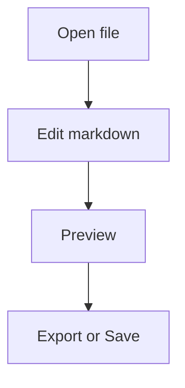

# Seditor Demo

このファイルは、Seditor の主な機能を一通り確認するためのデモです。  
`Ctrl + E` で編集とプレビューを切り替えながら触ってください。

---

## まず試すこと

- [ ] preview でこのチェックボックスをクリックできるか確認する
- [ ] `Ctrl + S` で保存する
- [ ] `Ctrl + F` で `Markdown` を検索する
- [ ] `Ctrl + E` で preview に切り替える
- [ ] 設定画面でフォントサイズを変える

---

## 見出しと目次

プレビュー右側のアウトラインで、見出しジャンプを確認できます。

### メモ

- 軽く起動する
- ローカル完結
- Markdown に集中できる

### TODO

1. 仕様を整理する
2. 文書を更新する
3. 公開する

---

## リンク

- 外部リンク: [OpenAI](https://openai.com/)
- 外部リンク: [Tauri](https://tauri.app/)
- 同一文書内リンク: [コード例へ移動](#コード例)

相対リンクも確認できます。

- ローカル相対リンク: [demo.css](./demo.css)

---

## インライン記法

- Inline code: `pnpm build`
- 強調: **important**
- 斜体: *note*
- 打ち消し: ~~old~~
- 挿入: ++new++
- 絵文字: :rocket:
- 上付き: 19^th^
- 下付き: H~2~O

---

## 引用

> 書くことに集中して、確認はすぐ横で行う。
>
> Seditor はそのための軽量エディタです。

---

## テーブル

| Feature | Shortcut | Note |
| :-- | :-- | :-- |
| Open | `Ctrl + O` | ファイルを開く |
| Save | `Ctrl + S` | 上書き保存 |
| Save As | `Ctrl + Shift + S` | 名前を付けて保存 |
| Toggle Preview | `Ctrl + E` | 編集 / プレビュー切替 |
| Print | `Ctrl + P` | PDF 出力にも使える |

---

## コード例

### TypeScript

```ts
type Task = {
  title: string;
  done: boolean;
};

const tasks: Task[] = [
  { title: "Write docs", done: true },
  { title: "Ship release", done: false },
];

const openTasks = tasks.filter((task) => !task.done);
console.log(openTasks);
```

### Rust

```rust
fn greet(name: &str) -> String {
    format!("Hello, {name}")
}
```

### JSON

```json
{
  "name": "seditor",
  "mode": "local-first",
  "supports": ["markdown", "mermaid", "math"]
}
```

---

## 数式

インライン数式: $E = mc^2$

ブロック数式:

$$
\int_0^1 x^2 dx = \frac{1}{3}
$$

---

## Mermaid



---

## 画像


---

## 注意書き

::: warning
このデモは機能確認用です。実際の運用では、最近使ったファイル、セッション復元、自動保存も活用してください。
:::

---

## 最後の確認

- [ ] リンクが開く
- [ ] チェックボックスが preview で操作できる
- [ ] Mermaid が描画される
- [ ] 数式が表示される
- [ ] コードブロックの copy が使える
